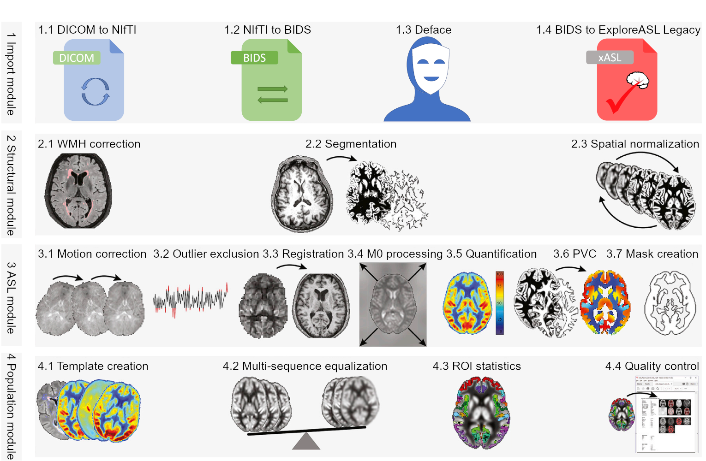

<!-- ALL-CONTRIBUTORS-BADGE:START - Do not remove or modify this section -->
[](#contributors-) [](https://doi.org/10.5281/zenodo.3905262) [](https://nl.mathworks.com/matlabcentral/fileexchange/83203-exploreasl)  [](https://exploreasl.github.io/Documentation/)
<!-- ALL-CONTRIBUTORS-BADGE:END -->

## Description

**ExploreASL** is a pipeline and toolbox for image processing and statistics of arterial spin labeling perfusion **MR** images. It is designed as a **multi-OS**, open-source, collaborative framework that facilitates cross-pollination between image processing method developers and clinical investigators.

The software provides a complete head-to-tail approach that runs fully automatically, encompassing all necessary tasks from data import and structural segmentation, registration, and normalization, up to **CBF** quantification. In addition, the software package includes quality control (**QC**) procedures and region-of-interest (**ROI**) as well as voxel-wise analysis of the extracted data. To date, **ExploreASL** has been used for processing ~10000 **ASL** datasets from all major **MRI** vendors and **ASL** sequences and a variety of patient populations, representing ~30 studies. The ultimate goal of **ExploreASL** is to combine data from multiple studies to identify disease-related perfusion patterns that may prove crucial in using **ASL** as a diagnostic tool and enhance our understanding of the interplay of perfusion and structural changes in neurodegenerative pathophysiology. 

Additionally, this (semi-)automatic pipeline allows us to minimize manual intervention, which increases the reproducibility of studies. 

## Documentation

Reference manual and tutorials for each ExploreASL version are found on the [GitHub website](https://exploreasl.github.io/Documentation). A general description of ExploreASL is in the [Neuroimage paper](https://pubmed.ncbi.nlm.nih.gov/32526385/). Additional resources are on the [ExploreASL website](https://www.ExploreASL.org) including the walkthrough document and how-to videos, but these are not regularly updated with new versions. For any help please use the [GitHub Discussion](https://github.com/ExploreASL/ExploreASL/discussions) or contact the ExploreASL team at [exploreasl.lab@gmail.com](mailto:exploreasl.lab@gmail.com).

## Installation

To use **ExploreASL** within Matlab, you can download a stable release version from the [GitHub releases section](https://github.com/ExploreASL/ExploreASL/releases) or from [Zenodo](https://doi.org/10.5281/zenodo.7702237). Alternatively the software can also be found on [Dockerhub](https://hub.docker.com/r/exploreasl/xasl). Navigate within Matlab to the **ExporeASL** directory, to make **ExploreASL** the current working directory. To start ExploreASL from Matlab, type:

```
ExploreASL
```

## Workflow



## Acknowledgments
This project is supported by the Dutch Heart Foundation (2020T049), the Eurostars-2 joint programme with co-funding from the European Union Horizon 2020 research and innovation programme ([ASPIRE E!113701](http://aspire-mri.eu/), including the Netherlands Enterprise Agency (RvO), and by the EU Joint Program for Neurodegenerative Disease Research, including the Netherlands Organisation for health Research and Development and Alzheimer Nederland ([DEBBIE JPND2020-568-106](https://www.neurodegenerationresearch.eu/wp-content/uploads/2021/03/Project-DEBBIE.pdf).

This project has previously received support from the following EU/EFPIA Innovative Medicines Initiatives (1 and 2) Joint Undertakings: [EPAD](http://ep-ad.org/) grant no. 115736, [AMYPAD](https://amypad.eu/) grant no. 115952 and [Amsterdam Neuroscience](https://www.amsterdamresearch.org/web/neuroscience/home.htm). The authors wish to thank the [COST-AID](https://asl-network.org/) (European Cooperation in Science and Technology - Arterial spin labeling Initiative in Dementia) Action BM1103 and the Open Source Initiative for Perfusion Imaging [(OSIPI)](https://www.osipi.org/) and the [ISMRM Perfusion Study groups](https://www.ismrm.org/study-groups/perfusion-mr/) for facilitating meetings for researchers to discuss the implementation of ExploreASL. The authors acknowledge Guillaume Flandin, Robert Dahnke, and Paul Schmidt for reviewing the structural module for its implementation of [SPM12](https://www.fil.ion.ucl.ac.uk/spm/software/spm12/), [CAT12](http://www.neuro.uni-jena.de/cat/), and [LST](https://www.applied-statistics.de/lst.html), respectively; Krzysztof Gorgolewksi for his advice on the [BIDS](https://bids.neuroimaging.io/) implementation; Jens Maus for help with MEX compilation; Cyril Pernet for providing the [SPM Univariate Plus](https://osf.io/wn3h8/) QC scripts.

## How to cite
The following provides an example as how to correctly cite ExploreASL and its third-party tools. The versions of the included third-party tools are described in [CHANGES.md](https://github.com/ExploreASL/ExploreASL/blob/main/CHANGES.md) for each ExploreASL release. The bare minimum of references (`refs`) are `ref1` and `ref2`.

>The data were analysed using ExploreASL `ref1` version x.x.x `ref2`, including SPM12 version xxxx `ref3`, CAT12 version xxxx`ref4`, and LST version x.x.x`ref5`. This Matlab-based software was used with Matlab (MathWorks, MA, USA) version x.x (yearx)`ref6`.

### References

The release numbers of ExploreASL (e.g. `1.9.0`) follow [semantic versioning](https://semver.org/).

1. The [ExploreASL paper](https://www.sciencedirect.com/science/article/pii/S1053811920305176), describing the full pipeline and decisions for processing steps.
2. The Zenodo DOI for the actual ExploreASL release used to analyse the data, e.g. the [latest release](https://doi.org/10.5281/zenodo.3905262)).
3. The SPM12 references [Ashburner, 2012](https://doi.org/10.1016/j.neuroimage.2011.10.025) & [Flandin and Friston, 2008](https://doi.org/10.4249/scholarpedia.6232). Note that the SPM version (e.g. `7219`) is adapted and extended for use with ExploreASL.
4. The CAT12 reference [Gaser, 2009](https://doi.org/10.1016/S1053-8119(09)71151-6). Note that the CAT12 version (e.g. `1364`) is adapted for use with ExploreASL.
5. The LST references [Schmidt, 2017](https://www.statistical-modelling.de/LST_documentation.pdf) & [de Sitter, 2017](https://doi.org/10.1016/j.neuroimage.2017.09.011). Note that the LST version (e.g. `2.0.15`) is adapted for use with ExploreASL.
6. Matlab publishes a [release](https://www.mathworks.com/help/matlab/release-notes.html) twice yearly. You can provide the release number (e.g. `9.4`) or year number (e.g. `2018a`), or both.

## Contributors ✨

Thanks goes to these wonderful people ([emoji key](https://allcontributors.org/docs/en/emoji-key)):

<!-- ALL-CONTRIBUTORS-LIST:START - Do not remove or modify this section -->
<!-- prettier-ignore-start -->
<!-- markdownlint-disable -->
<table>
  <tbody>
    <tr>
      <td align="center" valign="top" width="14.28%"><a href="http://www.ExploreASL.org"><br /><sub><b>Henk Mutsaerts</b></sub></a><br /><a href="[👨‍🔬 Mentor and Creator")," title="Mentor and Creator">👨‍🔬</a> <a href="#content-HenkMutsaerts" title="Content">🖋</a> <a href="https://github.com/ExploreASL/ExploreASL/commits?author=HenkMutsaerts" title="Code">💻</a></td>
      <td align="center" valign="top" width="14.28%"><a href="https://github.com/jan-petr"><br /><sub><b>Jan Petr</b></sub></a><br /><a href="[👨‍🔬 Mentor and Creator")," title="Mentor and Creator">👨‍🔬</a> <a href="#content-jan-petr" title="Content">🖋</a> <a href="https://github.com/ExploreASL/ExploreASL/commits?author=jan-petr" title="Code">💻</a></td>
      <td align="center" valign="top" width="14.28%"><a href="https://github.com/Vkeil-tech"><br /><sub><b>Vera Keil</b></sub></a><br /><a href="#ideas-vkeil-tech" title="Ideas, Planning, & Feedback">🤔</a> <a href="#research-vkeil-tech" title="Research">🔬</a> <a href="#promotion-vkeil-tech" title="Promotion">📣</a></td>
      <td align="center" valign="top" width="14.28%"><a href="https://github.com/wadqc"><br /><sub><b>Joost Kuijer</b></sub></a><br /><a href="#ideas-wadqc" title="Ideas, Planning, & Feedback">🤔</a> <a href="#research-wadqc" title="Research">🔬</a> <a href="#tool-wadqc" title="Tools">🔧</a></td>
      <td align="center" valign="top" width="14.28%"><a href="https://github.com/aot"><br /><sub><b>Aaron Oliver-Taylor</b></sub></a><br /><a href="[🧠 Data Acquisition & Management")," title="Data Acquisition & Management">🧠</a> <a href="#tool-aot" title="Tools">🔧</a> <a href="#plugin-aot" title="Plugin/utility libraries">🔌</a></td>
      <td align="center" valign="top" width="14.28%"><a href="https://github.com/MichaelStritt"><br /><sub><b>Michael Stritt</b></sub></a><br /><a href="https://github.com/ExploreASL/ExploreASL/commits?author=MichaelStritt" title="Code">💻</a> <a href="#content-MichaelStritt" title="Content">🖋</a> <a href="https://github.com/ExploreASL/ExploreASL/commits?author=MichaelStritt" title="Documentation">📖</a></td>
      <td align="center" valign="top" width="14.28%"><a href="http://www.amsterdamumc.nl"><br /><sub><b>Paul Groot</b></sub></a><br /><a href="https://github.com/ExploreASL/ExploreASL/commits?author=pfcgroot" title="Code">💻</a> <a href="#content-pfcgroot" title="Content">🖋</a></td>
    </tr>
    <tr>
      <td align="center" valign="top" width="14.28%"><a href="https://github.com/pvdemael"><br /><sub><b>Pieter Vandemaele</b></sub></a><br /><a href="https://github.com/ExploreASL/ExploreASL/commits?author=pvdemael" title="Code">💻</a> <a href="#ideas-pvdemael" title="Ideas, Planning, & Feedback">🤔</a> <a href="[🧠 Data Acquisition & Management")," title="Data Acquisition & Management">🧠</a></td>
      <td align="center" valign="top" width="14.28%"><a href="https://github.com/luislorenzini"><br /><sub><b>luislorenzini</b></sub></a><br /><a href="https://github.com/ExploreASL/ExploreASL/commits?author=luislorenzini" title="Code">💻</a> <a href="#tool-luislorenzini" title="Tools">🔧</a></td>
      <td align="center" valign="top" width="14.28%"><a href="https://github.com/MauricePasternak"><br /><sub><b>MauricePasternak</b></sub></a><br /><a href="[📊 Graphical User Interface")," title="Graphical User Interface">📊</a> <a href="https://github.com/ExploreASL/ExploreASL/commits?author=MauricePasternak" title="Code">💻</a> <a href="#design-MauricePasternak" title="Design">🎨</a></td>
      <td align="center" valign="top" width="14.28%"><a href="https://github.com/patsycle"><br /><sub><b>Patricia Clement</b></sub></a><br /><a href="[🧠 Data Acquisition & Management")," title="Data Acquisition & Management">🧠</a> <a href="#ideas-patsycle" title="Ideas, Planning, & Feedback">🤔</a> <a href="https://github.com/ExploreASL/ExploreASL/commits?author=patsycle" title="Documentation">📖</a></td>
      <td align="center" valign="top" width="14.28%"><a href="https://github.com/MDijsselhof"><br /><sub><b>Mathijs Dijsselhof</b></sub></a><br /><a href="#content-MDijsselhof" title="Content">🖋</a> <a href="[🧠 Data Acquisition & Management")," title="Data Acquisition & Management">🧠</a></td>
      <td align="center" valign="top" width="14.28%"><a href="https://github.com/BeatrizPadrela"><br /><sub><b>Beatriz Padrela</b></sub></a><br /><a href="#content-BeatrizPadrela" title="Content">🖋</a> <a href="[🧠 Data Acquisition & Management")," title="Data Acquisition & Management">🧠</a></td>
      <td align="center" valign="top" width="14.28%"><a href="https://github.com/sandeepganji"><br /><sub><b>Sandeep Ganji</b></sub></a><br /><a href="#content-sandeepganji" title="Content">🖋</a> <a href="#ideas-sandeepganji" title="Ideas, Planning, & Feedback">🤔</a> <a href="[🧠 Data Acquisition & Management")," title="Data Acquisition & Management">🧠</a></td>
    </tr>
    <tr>
      <td align="center" valign="top" width="14.28%"><a href="https://github.com/mcraig-ibme"><br /><sub><b>Martin Craig</b></sub></a><br /><a href="#content-mcraig-ibme" title="Content">🖋</a> <a href="https://github.com/ExploreASL/ExploreASL/commits?author=mcraig-ibme" title="Code">💻</a> <a href="[🧠 Data Acquisition & Management")," title="Data Acquisition & Management">🧠</a></td>
      <td align="center" valign="top" width="14.28%"><a href="https://github.com/jozsait"><br /><sub><b>jozsait</b></sub></a><br /><a href="https://github.com/ExploreASL/ExploreASL/commits?author=jozsait" title="Code">💻</a> <a href="#maintenance-jozsait" title="Maintenance">🚧</a></td>
      <td align="center" valign="top" width="14.28%"><a href="https://github.com/DaveThoma5"><br /><sub><b>DaveThoma5</b></sub></a><br /><a href="#ideas-DaveThoma5" title="Ideas, Planning, & Feedback">🤔</a> <a href="[🧠 Data Acquisition & Management")," title="Data Acquisition & Management">🧠</a></td>
    </tr>
  </tbody>
</table>

<!-- markdownlint-restore -->
<!-- prettier-ignore-end -->

<!-- ALL-CONTRIBUTORS-LIST:END -->

This project follows the [all-contributors](https://github.com/all-contributors/all-contributors) specification. Contributions of any kind welcome!
